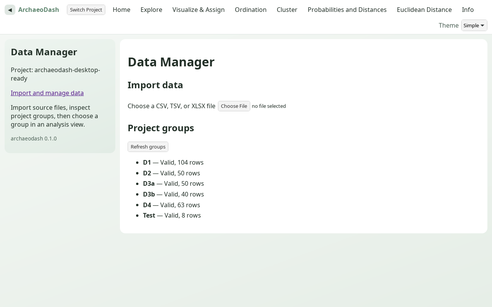
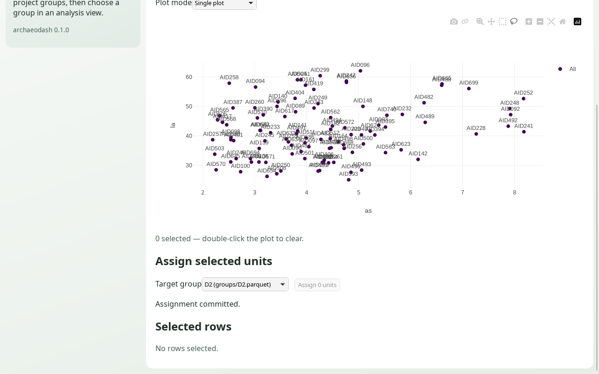

# Desktop test drive

This is a short local smoke walkthrough for the native Tauri desktop app. It
uses the checked-in `fixtures/INAA_test.csv` and does not require an API
service or account. On first use, Cargo and pnpm may download the locked build
dependencies. The built app itself does not contact a hosted API.

## Prepare a disposable project

From any working directory, run:

```sh
/path/to/ArchaeodashDesktop/scripts/prepare-desktop-test-project.sh
```

The default project is `${TMPDIR:-/tmp}/archaeodash-desktop-test-drive`. To
choose a different destination, pass a new directory path. The setup refuses
to use an existing path. It copies the fixture into the new project and uses
the app's Rust import preview and commit services to create the initial group
files partitioned by `CORE`.

## Launch and walk through

Run the app from any directory:

```sh
/path/to/ArchaeodashDesktop/scripts/run-desktop.sh
```

In the app:

1. Choose **Open Project** and select the prepared test project folder.
2. Choose **Import and manage data** in the Data Manager sidebar. The five
   prepared groups should show as valid. To test importing, choose the copied
   `INAA_test.csv`, select `CORE` as **Group column**, review the measured columns
   and five partitions, then choose **Import groups**. Existing files are retained;
   subsequent imports use unused filenames. For a file without a group column,
   choose **Put every row in one named group**, enter a name, preview, then import.
3. Choose **Explore**, select `groups/D1.parquet`, and inspect the rows. Original
   measured columns are read-only; descriptive fields have explicit save controls.
4. Choose **Cluster**, select `groups/D1.parquet`, keep **k-means** and two clusters,
   then choose **Run analysis**. A partition plot and 104 result rows should appear.
5. Return to **Explore** and choose **Export measured data (CSV)**. In the native
   save dialog, save `D1.csv` into the test project. Cancelling the dialog writes
   nothing. Inspect the CSV in a spreadsheet or text editor.
6. Close and relaunch the app, reopen the same folder, and confirm the group list
   and saved CSV are still present. The app requires you to choose the folder
   again; it does not yet reopen the last project automatically.

The scripts resolve paths relative to themselves, so the current shell
directory does not need to be the repository. The launcher checks for a
working pnpm executable at the version pinned by the lockfile, installs
JavaScript dependencies, builds the web assets, and starts the native app.
First launch may download Rust build dependencies; the running app does not
need an API service or network connection. Project data stays in the chosen
project folder.

## Initial test limits

Use a disposable copy of data and keep other programs from editing its group files
during this initial test. Application reads, scans, imports, and transactions now
coordinate through the project lock; external programs that ignore it remain
outside that protection.

This walkthrough checks basic project opening, import, analysis, export, and
reopen behavior on the current machine. It does not establish cross-platform
performance, large-dataset limits, packaging/installer behavior, or full
statistical parity. The initial desktop release still uses the native folder
picker for project selection. Broader native workflow acceptance and performance gates
remain open in the [Phase 6 validation report](phase-6-validation-2026-09-28.md).

## Verified checkpoint — 2026-09-28

The launcher completed locked dependency installation, the production web build,
and actual native Tauri launch on Linux. The sample generator produced five valid
groups totaling 307 rows and refused an existing destination.

Using the real GTK/WebKit desktop window on an isolated X11 display, the test
opened the sample folder, validated its groups, ran k-means on D1 (104 result
rows), cancelled a UMAP analysis, imported an eight-row CSV through the native
file picker, and preserved the project when folder selection was cancelled.
Native CSV saving produced eight rows with measured values exactly equal to the
synthetic source; cancelling a subsequent save preserved the saved file hash.
After a normal window-close request and relaunch, the original and imported
groups were rediscovered and the CSV hash remained unchanged. A normal pointer
and keyboard dataset switch was also exercised.



Workspace verification passed 223 Rust tests, 93 web tests, 38 client tests,
typechecks, Rust formatting, and affected-library Clippy including Tauri. The
new `scripts/e2e/import.mjs` passed eight browser import checks. The web build
retains its existing large Plotly chunk warning.

One exploratory accessibility-automation attempt that directly invoked a native
select-popup item terminated a WebKit content process. The subsequent ordinary
pointer/keyboard selection and the save/reopen walkthrough passed without that
failure. This initial smoke result is not a native stability or accessibility
certification; wider native and cross-platform testing remains necessary.

## Phase 6 native assignment check — verified on Linux, 2026-09-30

Use a separate disposable project so the basic import/export walkthrough stays
unchanged. Run these from the repository root; choose another new path if this
one already exists:

```sh
scripts/prepare-desktop-test-project.sh /tmp/archaeodash-desktop-assignment-drive
scripts/run-desktop.sh
```

In the native app, open that project and:

1. Open **Visualize & Assign** and select `groups/D1.parquet`.
2. Lasso a single visible point. Confirm the status reads `1 selected` and note
   its visible sample ID and measured values in **Selected rows**. If the lasso
   selects more than one row, clear the selection and retry.
3. Set **Target group** to `groups/D2.parquet` and choose **Assign 1 unit**.
   Confirm the app reports **Assignment committed** and clears the selection.
4. Open the source and destination in **Explore**. Verify the sample ID is gone
   from D1, appears once in D2, and retains the measured values recorded before
   the move. Confirm D1 lost one row and D2 gained one row.
5. Close and reopen the project, then repeat the source/destination checks.

The actual GTK/WebKit Tauri window passed this path on an isolated Linux X11
display. Pointer lasso selected AID669, the native UI moved it from D1 to D2,
and the app reported **Assignment committed** with the selection cleared.
D1 changed from 104 to 103 rows; D2 changed from 50 to 51. A read-only Parquet
comparison against snapshots confirmed the same hidden identity, all 33 original
measured values, all descriptive fields, and every other row unchanged. After
closing and relaunching the app and reopening the project through the native
folder picker, Explore's accessibility tree contained 103 source rows without
AID669 and 51 destination rows with AID669 exactly once.

This test exposed a WebKit layout defect: the plot holder collapsed and the
canvas covered the assignment controls. An explicit 450-pixel holder now keeps
those controls below the plot. The Plotly wrapper also awaits rendering before
attaching selection handlers, retains current callbacks without restarting the
plot on every selection, and exposes rendering failures visibly.



The separate `pnpm test:e2e:visualize-assignment` regression uses a real Chromium
mouse gesture against the API/production web build, verifies layout and full row
preservation, and reloads the datasets. It runs in browser CI. The native result
above verifies Linux WebKit only; Windows/macOS native acceptance and portable
performance budgets remain open.
